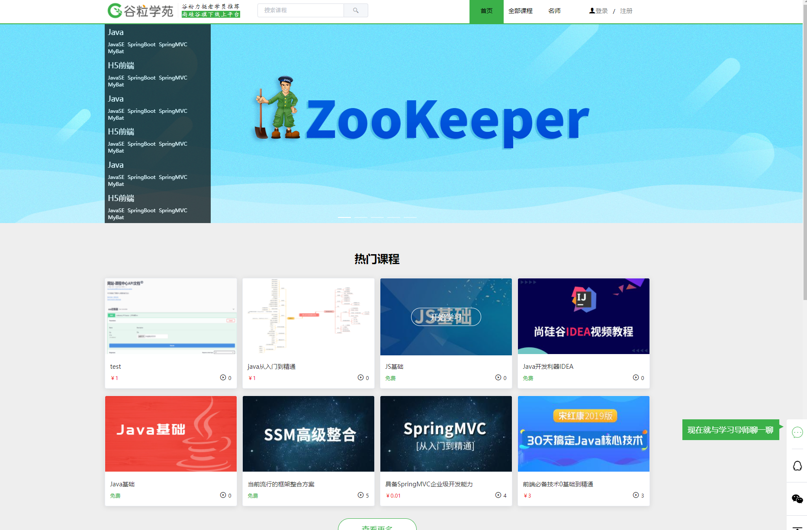
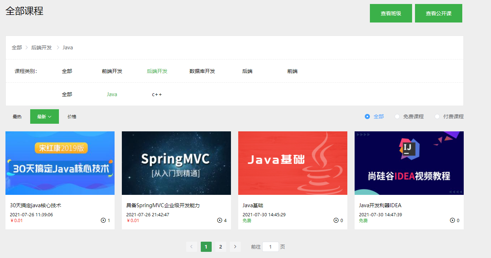
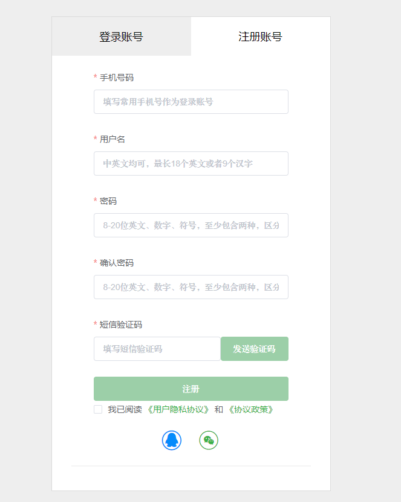
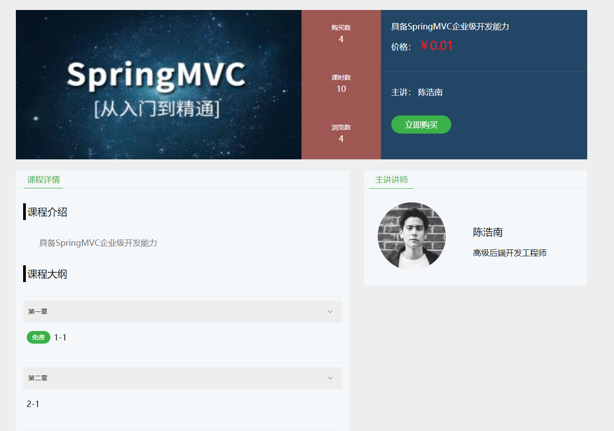
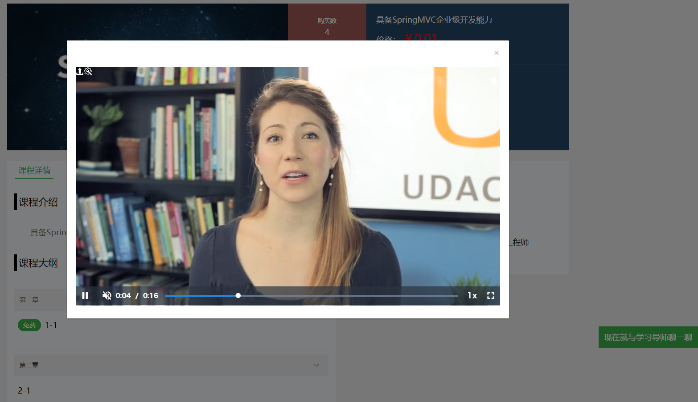
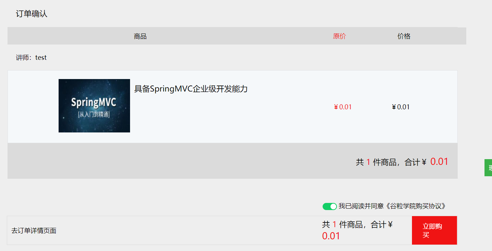
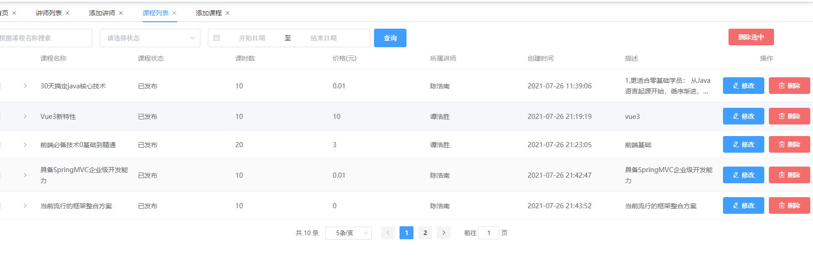
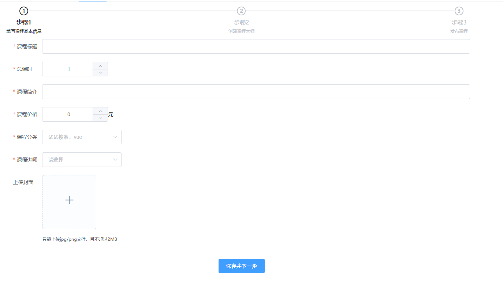
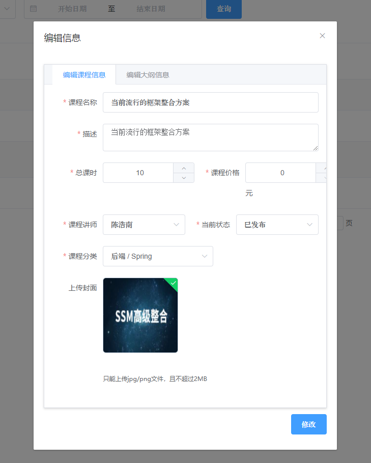

# 在线教育平台

该项目只是前端部分，后端部分在这里https://github.com/XMMarlowe/onlineEducation

## 功能概述

本系统分为前台和后台两个模块，前台用于用户，后台用于系统管理。

### 前台：

前台主要有课程，教师，订单三个部分组成，用户可以注册登录，登录之后浏览课程并可以观看。课程下面有章节，每一个章节下面有小节，如果课程是免费的就可以全部直接观看，如果课程是付费的，就只能观看免费的小节，其他的就需要购买后才能观看。

当课程付费时，需要创建订单，然后跳到支付界面使用微信扫码支付，支付成功后就可以进行观看了。

同时可以通过搜索课程，或者分类查询（通过课程的类别，所属讲师）进行查找。

### 后台：

后台一共分为以下几个模块

- 主页轮播图管理
- 课程管理
- 课程分类管理
- 讲师管理
- 数据统计

## 部分截图

